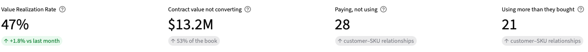
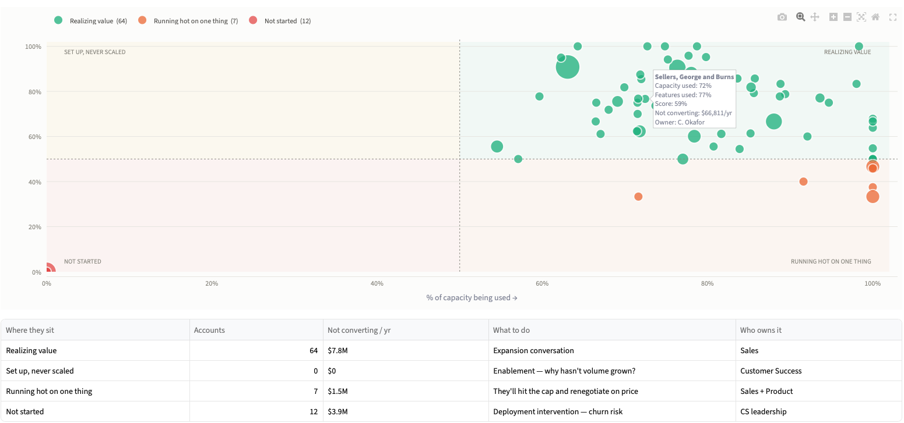

# Product Adoption & Value Realization Framework

**A framework for answering one question a SaaS business usually can't: *is the customer actually using what they bought — and what is the gap worth?***

---

## Start here

Most SaaS businesses can answer *did they buy?* and *did they renew?* Almost none can answer the question in between. That question is worth more than either, because it's the only one you can still act on.

This repo is a working answer, end to end: a realistic messy dataset → BigQuery → a metric pipeline → tests that check the metric is *right* → a dashboard three different audiences can use. It was built spec-first: the argument is written down before the code, and the code is an artifact of it.

**What it is not:** production software, or proof that this metric predicts churn. It runs on synthetic data by design — see [Known limitations](#known-limitations), which is the honest version of that sentence.

<p align="center">
  
</p>

---

## How to read this repo

| If you have | Read | You'll come away knowing |
|---|---|---|
| **5 minutes** | this page | The metric, why it's two numbers and not one, and what it found |
| **20 minutes** | [`specs/01_product_spec.md`](specs/01_product_spec.md) | The argument — why this metric, how it rolls up, what breaks it, and how you'd compensate against it |
| **45 minutes** | [`specs/02_technical_spec.md`](specs/02_technical_spec.md) → [`pipeline_and_tests/sql/`](pipeline_and_tests/sql/) | How 15 SQL models turn raw usage into a defensible number |
| **An afternoon** | [Run it](#run-it--five-commands) | All of it, on your own BigQuery project, in about three minutes of runtime |

**If you only open one file, open [`specs/01_product_spec.md`](specs/01_product_spec.md).** It opens with a revision history — this framework went through nine versions, and the metric got *simpler* each time.

---

## The metric, in one line

> **VRR = the share of what a customer paid for that they're actually using.**

Think of a contract as a square: every feature they bought across every unit of capacity they bought. VRR is how much of that square they occupy.

```
VRR  =  Feature Coverage  ×  Consumption Rate

         how many of the      how much of the
         features they        capacity they
         bought are they      bought are they
         using?               using?
```

**Acme Financial** — $100k/year, 4 features, 10M credits.
They use 1 of 4 features and burn 80% of their credits.

```
Feature Coverage  =  33%
Consumption Rate  =  80%
VRR               =  26%      →   $74k of that contract isn't converting
```

They bought a platform and deployed a point tool. Neither number alone would have caught it.

---

## Why two numbers, not one

Because the same score means four completely different problems — with four different owners and four different plays.

<p align="center">
  
</p>

An account at 40% because it uses one feature intensely is a *pricing* conversation. An account at 40% because it's set up everywhere and barely used is an *enablement* conversation. Collapse the two inputs into one score and you lose the ability to tell them apart — which is exactly how adoption dashboards end up admired and unused.

## Why the dollar figure matters more than the ratio

VRR is a ratio, and ratios can't be added across customers. Dollars can.

```
Value at Risk  =  contract value  ×  (1 − VRR)
```

**VRR diagnoses. Value at Risk prioritizes.** One tells a PM what's broken; the other tells a GM what it's worth fixing — and it sums cleanly by segment, region, or platform.

---

## What's in here

```
specs/
  01_product_spec.md      The argument. Metric definition, roll-ups, edge cases,
                          incentive design, limitations. Read this first.
  02_technical_spec.md    Data model, the 15 models, test strategy, traceability.

data_generation/
  generate_dataset.py     100 customers, 500 products, 2,012 features, 15 months.
                          Seeded — same dataset every time. 12 realities injected.
  load_to_bigquery.py     Idempotent load with row-count verification.

pipeline_and_tests/
  sql/                    15 models: staging → intermediate → 6 marts.
  run_pipeline.py         Runs them in order and publishes a data-quality audit.
  tests/                  40 tests. 16 on the generator, 24 on the pipeline.

dashboard/
  app.py                  Streamlit. Five views: Overview, Customers, Products,
                          Owners, Data Quality.

docs/
  executive_deck.pdf      The 14-slide version of this argument.
  screenshots/            What the dashboard actually looks like.
```

---

## Run it — five commands

```bash
cp .env.example .env          # add your GCP project + dataset names
python data_generation/generate_dataset.py     # ~5s, deterministic (seed 42)
python data_generation/load_to_bigquery.py     # ~30s
python pipeline_and_tests/run_pipeline.py      # ~60s, 15 models
pytest pipeline_and_tests/tests/ -q            # 40 tests
streamlit run dashboard/app.py                 # opens in your browser
```

**Requirements:** Python 3.12, a BigQuery project (the free Sandbox is enough), and a service-account key. `pip install -r requirements.txt`.

Everything is seeded, so you get the same dataset every time. Nothing is hardcoded — point `.env` at a different project and it runs there.

---

## What makes this more than a metric

### The data is deliberately messy — twelve ways

Enterprise data is never clean. Five of these behaviours were specified; **seven were added because they're the ones that actually break adoption metrics in production.**

| Customer behaviour | Data integrity *(added)* |
|---|---|
| Spike & drop — burn it all, then vanish | Duplicate rows from a pipeline re-run |
| Shelfware — paying, using nothing | "Unlimited" contracts with no denominator |
| Chronic overage — consuming 120%+ | Usage on features they never bought |
| Mid-year expansion — overlapping contracts | Renewal gaps — contract lapsed, then renewed |
| Brand-new deployments | Data still loading for the current month |
| | Internal test accounts in production data |
| | Contracts in EUR and GBP |

Three of those changed the framework itself, not just the cleaning rules:

- **Unlimited contracts have no denominator.** They're scored on coverage alone. Substituting 100% would make them look like the healthiest accounts you have.
- **Renewal gaps create a third state.** Not healthy, not at risk — **not applicable**. Most frameworks only have two, which is why they dispatch someone to rescue an account that was waiting on paperwork.
- **A number can be correct but not final.** The current month is marked incomplete and drawn greyed. Hide that, and the first time an exec notices the number moving, they stop trusting every number on the page.

### The tests check answers, not just plumbing

The generator secretly labels each customer's intended behaviour in a column **no pipeline model is allowed to read**. The tests then ask: *did the metric independently rediscover what we planted?*

Row counts and null checks prove the pipeline **ran**. These prove it was **right**.

Four tests exist because something went wrong while building this — including one that simply asserts the portfolio value is *plausible*, after an early version confidently reported $1.9B of risk across 97 customers.

### Every row dropped is on the record

```
model                  action              removed   note
stg_consumption        dedupe                   84   duplicate contract-months
stg_customers          exclude internal          3   internal/test tenants
stg_consumption        zero-fill              -684   months with no usage row → 0, not NULL
stg_feature_activity   drop unentitled         395   usage outside the SKU
int_flags              mark incomplete         144   2026-08 still loading
```

Printed on every run, appended to a `pipeline_audit` table, and shown in the dashboard.

**Silent cleaning is how data teams lose trust.** A number moves, nobody can explain it, and after that every number gets questioned.

---

## How it was built

Spec-driven, with AI tooling, in that order — verifiable in `git log`: the specs were committed **before** any implementation code.

1. Write the spec in Markdown
2. Generate the implementation from it
3. Derive tests from the **spec**, not the code, so they assert intended behaviour rather than describing whatever got built
4. When the design changed, amend the spec and regenerate — the geometric mean that opened v0.1 was removed outright, not patched around

The specs are the source of truth. The code is an artifact of them.

---

## Known limitations

Stated up front rather than discovered in review.

- **Feature value weights are asserted, not derived.** Core=3 / Differentiator=2 / Adjacent=1 is a product judgment. Deriving them from renewal correlation on *synthetic* data would mean fitting weights to patterns we injected ourselves. The production path is in spec §9.
- **Synthetic data validates mechanics, not predictive power.** These tests prove the logic handles twelve messy realities. They can't prove VRR predicts churn — that needs a backtest against real history.
- **Narrow-but-deep customers score low.** Someone using two features intensely and loving it looks bad here. A real false negative, and fixing it needs an "intended scope" field our systems don't capture.
- **BigQuery Sandbox expires tables after 60 days.** Re-run the five commands above and everything rebuilds from scratch.
